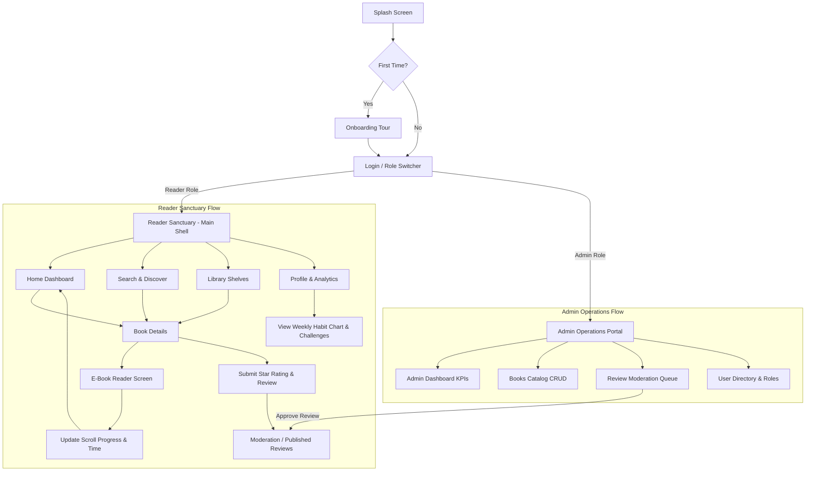

# 📚 BookWorm — E-Book Library, Reading Tracker & Community Hub

<div align="center">


**A modern, centralized Flutter application for organizing digital libraries, tracking reading habits, sharing verified reviews, and conquering reading challenges.**

</div>

---

## 📋 Table of Contents
- [Executive Overview](#-executive-overview)
- [Problem Statement](#-problem-statement)
- [Key Objectives](#-key-objectives)
- [Expected Outcomes](#-expected-outcomes)
- [Project Deliverables](#-project-deliverables)
- [System Architecture & Directory Structure](#-system-architecture--directory-structure)
- [Feature Breakdown & Implemented Modules](#-feature-breakdown--implemented-modules)
- [Technology Stack](#-technology-stack)
- [User Journey & Figma Flow](#-user-journey--figma-flow)
- [Installation & Getting Started](#-getting-started)
- [Verification & Quality Assurance](#-verification--quality-assurance)
- [Roadmap & Next Steps](#-roadmap--next-steps)
- [License](#-license)

---

## 📖 Executive Overview

**BookWorm** (Application Name 50) is an e-book reading sanctuary and library management platform developed with Flutter and Dart. Designed to solve reading fragmentation, BookWorm integrates reading catalog organization, chapter-by-chapter reading interfaces, live reading pace tracking, community-driven book reviews, reader habit analytics, and dual-mode administrative controls into a unified, responsive **Material 3** application.

---

## 🎯 Problem Statement

> **Problem Statement (100 Words):**  
> E-book readers may need a centralized platform to organize books, monitor reading progress, share reviews and participate in reading challenges. BookWorm will provide a Flutter interface for managing an e-book library, tracking reading progress, submitting reviews and participating in reading challenges.

Avid digital readers frequently struggle with scattered reading experiences across multiple disconnected apps—lacking a cohesive environment where they can manage their digital bookshelves, customize reading typography, log daily reading time, evaluate peer reviews, and participate in motivating reading challenges. BookWorm bridges this gap through a clean, intuitive, and feature-complete mobile experience.

---

## 🎯 Key Objectives

1. **UI/Widgets**:
   - Build a comprehensive reading dashboard, e-book library catalog, book detail screen, immersive e-book reader, reading-progress tracker, interactive review section, and reading-challenge indicators.
   - Utilize Flutter widgets including `Cards`, `ListViews/Gridviews`, `SearchBar`, `FilterChips`, `ProgressIndicators`, `RatingBar`, `Forms`, `TextFields`, `ElevatedButtons`, `Dialogs`, and robust modal navigation.
2. **Styling & Theming**:
   - Apply strict **Material Design 3** theming with warm reading palettes (Warm Paper `#FAF8F5`, Amber `#E08736`, Deep Indigo `#1E293B`).
   - Implement customizable reading environments with 4 color modes (Cream Paper, Warm Sepia, Night Indigo, Dark AMOLED) and typography selection (Google Fonts `Literata`, `Bricolage Grotesque`, `Roboto`).
3. **Dart & Flutter Logic**:
   - Construct robust data models (`Book`, `Review`, `Chapter`, `BookHighlight`, `ReadingGoal`, `ReaderSettings`, `AdminMetrics`).
   - Implement multi-criteria real-time search/filtering, reading progress computations, review submission validation, star rating math, challenge goal calculations, and state management using `Provider`.
4. **Figma User Flow**:
   - Design and demonstrate the complete end-to-end user journey:
     $$\text{Library} \longrightarrow \text{Search / Select Book} \longrightarrow \text{Read E-Book} \longrightarrow \text{Track Progress} \longrightarrow \text{Submit Review} \longrightarrow \text{Participate in Reading Challenge}$$

---

## 🏆 Expected Outcomes

- **Functional Flutter Prototype**: A working cross-platform prototype demonstrating core e-book reading, library organization, and review workflows.
- **Modern Flutter Engineering**: Structured, reactive, maintainable, and responsive screens adhering to clean separation of concerns.
- **Material 3 Experience**: Reading controls, eye-friendly typography, dynamic progress bars, and reactive state updates.
- **Complete End-to-End User Journey**: From onboarding and library browsing to reading chapters, bookmarking passages, rating books, and viewing reading analytics.

---

## 📦 Project Deliverables

| Deliverable | Specification & Status |
| :--- | :--- |
| 🎨 **Figma Design Flow** | User journey from library catalog through reading interface, progress tracking, reviews, and reading challenges. |
| 🧩 **UI & Widgets Library** | Reusable `BookCard` (Hero, Grid, List modes), `StreakBadge`, `ReadingProgressBar`, `RatingStars`, `CustomBottomNav`, modal sheets, and scanner dialogs. |
| 🎨 **Styling & Theming** | Complete Material 3 Light/Dark theme configuration, custom typography system (`AppTypography`), 4 reading themes, and responsive adaptations. |
| ⚙️ **Dart & Flutter Logic** | Typed models, shelf filters, instant search, reading progress calculations, review submission, chapter bookmarking, and `ChangeNotifier` state providers. |
| 🛡️ **Admin & Management Portal** | Dedicated Admin Portal featuring KPI dashboard, book catalog CRUD with modal editor, review moderation workflow, and user directory management. |
| 🔄 **State Management** | MultiProvider state architecture orchestrating `LibraryProvider`, `ReaderProvider`, and `AdminProvider`. |

---

## 🏗️ System Architecture & Directory Structure

The project follows a clean, feature-driven structure:

```text
lib/
├── data/
│   └── mock_books_data.dart            # Rich mock catalog with multi-chapter content & reviews
├── models/
│   ├── admin_metrics.dart              # Models for admin KPIs, moderation, user directory
│   ├── book.dart                       # Book, Chapter, Review, Highlight, ShelfStatus enums
│   ├── reader_settings.dart            # Reader typography, font size, theme modes
│   └── reading_goal.dart               # Daily/yearly targets, streaks, weekly minutes history
├── providers/
│   ├── admin_provider.dart             # Admin CRUD, review moderation, user status management
│   ├── library_provider.dart           # Library shelves, active reads, search/filters, goals
│   └── reader_provider.dart            # Reader theme, chapter navigation, bookmarks, highlights
├── screens/
│   ├── admin/
│   │   ├── books/
│   │   │   ├── add_edit_book_modal.dart # Full catalog book creation/editing modal
│   │   │   └── admin_books_screen.dart # Catalog table with publication status & actions
│   │   ├── dashboard/
│   │   │   └── admin_dashboard_screen.dart # High-impact KPI grid, activity logs, platform health
│   │   ├── reviews/
│   │   │   └── admin_reviews_screen.dart # Moderation queue with Approve / Reject / Flag actions
│   │   ├── users/
│   │   │   └── admin_users_screen.dart # User accounts directory with role promotion & suspension
│   │   └── admin_shell.dart            # Dedicated Admin navigation shell
│   ├── auth/
│   │   └── login_screen.dart           # Reader sign-in with quick Admin bypass demo switcher
│   ├── details/
│   │   └── book_detail_screen.dart     # Book metadata, synopsis, author spotlight, reviews modal
│   ├── home/
│   │   └── home_screen.dart            # Daily goal ring, continue-reading hero, curated carousels
│   ├── library/
│   │   └── library_screen.dart         # Tabbed shelves (Reading, To Read, Finished, Favorites)
│   ├── onboarding/
│   │   └── onboarding_screen.dart      # 3-step interactive onboarding (pace, genres, goal)
│   ├── profile/
│   │   └── profile_screen.dart         # Reading analytics, weekly bar chart, achievements, settings
│   ├── reader/
│   │   └── reader_screen.dart          # Immersive reader, scroll tracker, typography settings modal
│   ├── search/
│   │   ├── barcode_scanner_modal.dart  # Interactive camera/barcode scan simulation
│   │   └── search_screen.dart          # Live instant search, category chips, recent query history
│   ├── splash/
│   │   └── splash_screen.dart          # Animated startup screen with route branching
│   ├── wishlist/
│   │   └── wishlist_screen.dart        # Saved books queue with quick shelf migration
│   └── main_shell.dart                 # Reader bottom navigation host (Home, Search, Library, Wishlist, Profile)
├── theme/
│   ├── app_theme.dart                  # Material 3 ColorScheme, component styles, elevation
│   └── app_typography.dart             # Typography definitions powered by Google Fonts
├── widgets/
│   ├── book_card.dart                  # Reusable book card supporting Hero, Grid, and List layouts
│   ├── custom_bottom_nav.dart          # Floating pill-style bottom navigation bar
│   ├── rating_stars.dart               # Configurable star rating visualizer
│   ├── reading_progress_bar.dart       # Smooth animated progress indicators
│   └── streak_badge.dart               # Flame streak counter indicator
└── main.dart                           # MultiProvider setup & application root
```

---

## ✨ Feature Breakdown & Implemented Modules

### 1. 🏠 Reading Dashboard (`HomeScreen`)
- **Daily Reading Goal Ring**: Circular indicator displaying today's minutes read vs. target (e.g., 32 / 45 mins).
- **Hero Continue Reading**: Prominently highlights the currently active book with resume button and progress.
- **Curated Collections Carousel**: Horizontal card slider categorized by genres (Technology, Philosophy, Psychology).
- **Streak Tracker**: Real-time flame badge tracking continuous reading days.

### 2. 📚 Library & Shelf Management (`LibraryScreen` & `WishlistScreen`)
- **Segmented Shelves**: 4 interactive tabs — *Currently Reading*, *Want to Read*, *Finished*, and *Favorites*.
- **Live Statistics Ribbon**: Aggregate counters for active books, completed titles, and total pages read.
- **Dynamic Shelf Shifting**: Seamlessly update books between reading statuses with automatic progress updates.

### 3. 📖 Immersive E-Book Reader (`ReaderScreen`)
- **Full Longform Reading**: Multi-chapter reader with real literary content.
- **Reading Experience Customization**:
  - **4 Paper Themes**: Cream Paper, Warm Sepia, Night Indigo, Dark AMOLED.
  - **3 Typefaces**: *Literata* (Serif), *Bricolage Grotesque* (Editorial), *Roboto* (Clean Sans).
  - **Fluid Font Sizing**: Dynamic typography slider with real-time text scaling.
- **Reading Progress Tracking**: Live scroll-percentage listener, estimated minutes remaining, and chapter progression.
- **Chapter Bookmarking & Highlights**: In-session chapter bookmarks and passage saving.

### 4. 🔍 Search & Discovery (`SearchScreen`)
- **Instant Multi-Field Search**: Searches title, author, genre, tags, and ISBN simultaneously.
- **Genre Filter Chips**: Instant category filtering with active badge states.
- **Barcode & ISBN Scanner**: Built-in modal simulating camera barcode scanning for instant book lookup.
- **View Toggle**: Switch between compact list view and 2-column grid view.

### 5. ⭐ Community Reviews & Ratings (`BookDetailScreen`)
- **Rich Review Cards**: User avatars, star ratings, submission timestamps, and feedback comments.
- **Review Submission Modal**: Interactive 5-star rating selector, validated feedback text field, and live list injection.

### 6. 🏆 Reading Challenges & Analytics (`ProfileScreen` & `HomeScreen`)
- **Weekly Activity Chart**: 7-day bar visualizer showing daily minutes read.
- **Gamified Achievements**: Badges for *14-Day Streak*, *500+ Pages Read*, and *Polymath (4+ Genres)*.
- **Yearly Book Challenge**: Progress tracking towards annual reading targets (e.g., 9/25 books completed).

### 7. 🛡️ Dual-Mode Role & Admin Portal (`AdminShell`)
- **Role Switching**: Effortlessly toggle between **Reader Sanctuary** and **Admin Portal**.
- **Operations Dashboard**: System health indicator, KPI metric tiles, and activity stream.
- **Catalog Management**: Add new books, modify existing titles, toggle draft/published status, or delete records.
- **Review Moderation Queue**: Moderate community reviews with Approve, Reject, or Flag actions.
- **User Directory**: Manage reader/curator/admin permissions and toggle account suspension.

---

## 🛠️ Technology Stack

| Layer | Technology | Details |
| :--- | :--- | :--- |
| **Language** | [Dart](https://dart.dev) (v3.3+) | Sound null safety, strongly typed models, functional collection methods |
| **Framework** | [Flutter](https://flutter.dev) (v3.19+) | Cross-platform UI toolkit with smooth 60fps animations |
| **Design System** | Material Design 3 | Harmonious color scheme, custom typography, elevation, accessibility |
| **State Management** | [Provider](https://pub.dev/packages/provider) (v6.1.2) | `ChangeNotifierProvider` and `MultiProvider` pattern |
| **Typography** | [Google Fonts](https://pub.dev/packages/google_fonts) (v6.2.1) | `Literata`, `Bricolage Grotesque`, `Inter` |
| **Formatting** | [Intl](https://pub.dev/packages/intl) (v0.20.2) | Date and number formatting helpers |

---

## 🔄 User Journey & Figma Flow



---

## 🚀 Getting Started

### Prerequisites
- [Flutter SDK](https://docs.flutter.dev/get-started/install) (version `>= 3.19.0`)
- [Dart SDK](https://dart.dev/get-dart) (version `>= 3.3.0`)
- Target device / emulator (Android, iOS, macOS, Chrome Web)

### Step-by-Step Installation

1. **Clone the repository**:
   ```bash
   git clone https://github.com/your-username/bookWorm.git
   cd bookWorm
   ```

2. **Fetch dependencies**:
   ```bash
   flutter pub get
   ```

3. **Verify analyzer & linting**:
   ```bash
   flutter analyze
   ```

4. **Launch the application**:
   ```bash
   # Run on connected device or default browser
   flutter run

   # Or run specifically on Chrome
   flutter run -d chrome

   # Or run on macOS desktop
   flutter run -d macos
   ```

---

## 🧪 Verification & Quality Assurance

- **Code Quality**: Structured with strict linting rules (`flutter_lints: ^6.0.0`).
- **Null Safety**: 100% sound null safety across all models, providers, and UI screens.
- **State Integrity**: Verified multi-provider reactivity where updates in reader progress immediately reflect across Home, Library, and Profile screens.

---

## 🗺️ Roadmap & Next Steps

- [x] Complete Material 3 UI screens and component design system
- [x] Multi-shelf library management and priority book tracking
- [x] Full-fledged e-book reader with 4 themes and typography controls
- [x] Review submission and star rating calculations
- [x] Admin management portal with book CRUD and review moderation
- [ ] Dedicated standalone Reading Challenges screen (with public challenge creation and community leaderboards)
- [ ] Persistent local storage layer using `hive` / `shared_preferences`
- [ ] Direct EPUB / PDF file parser integration
- [ ] Cloud synchronization via Firebase / REST backend

---

## 📄 License

This project is open-source and available under the [MIT License](LICENSE).
