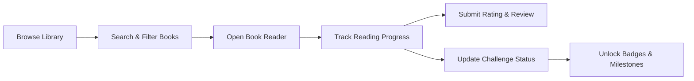

# 📚 BookWorm — E-Book Library, Tracker & Reading Community

<div align="center">


**A modern, centralized Flutter application for organizing e-books, monitoring reading habits, writing reviews, and conquering reading challenges.**

</div>

---

## 📖 Overview & Problem Statement

E-book enthusiasts and avid readers often struggle with fragmented experiences across multiple platforms—lacking a unified space to organize their digital libraries, track chapter-by-chapter reading milestones, write and discover book reviews, and stay motivated through reading challenges.

**BookWorm** solves this by providing a unified, cross-platform Flutter mobile interface designed for seamless e-book management, immersive reading progress tracking, interactive community reviews, and gamified reading challenges.

---

## 🎯 Key Objectives

- **UI & Widgets**: Build an intuitive reading dashboard, e-book library catalog, book detail/reader view, live reading-progress tracker, interactive review section, and gamified reading-challenge screens. Utilize Flutter widgets such as `Cards`, `ListViews/Gridviews`, `SearchBar`, `FilterChips`, `ProgressIndicators`, `RatingBar`, `Forms`, `TextFields`, `ElevatedButtons`, `Dialogs`, and robust navigation.
- **Styling & Theming**: Apply modern **Material 3** guidelines with comfortable reading typography (dark/light themes, eye-friendly contrast), clear progress visualizers, accessible touch targets, and responsive layouts across phone and tablet form factors.
- **Dart & Flutter Logic**: Implement structured data models (`Book`, `ReadingProgress`, `Review`, `Challenge`), search and multi-criteria filtering, persistent progress tracking, form validation, dynamic rating computation, challenge milestone calculations, and clean state management.
- **Figma Design Flow**: Complete end-to-end user journey:
  $$\text{Library} \longrightarrow \text{Search / Select Book} \longrightarrow \text{Read E-Book} \longrightarrow \text{Track Progress} \longrightarrow \text{Submit Review} \longrightarrow \text{Participate in Reading Challenge}$$

---

## ✨ Core Features

| Feature | Description |
| :--- | :--- |
| 📊 **Reading Dashboard** | High-level snapshot of current reads, daily streak, reading velocity, weekly targets, and quick-resume shortcuts. |
| 📚 **E-Book Library** | Comprehensive book collection with category filtering, real-time search, sorting (author, genre, status), and shelf management. |
| 📖 **Book Detail & Reader** | Immersive reader interface with page-flipping / scrolling, chapter outline, reading mode presets (light, sepia, dark), and font adjustments. |
| 📈 **Progress Tracker** | Real-time percentage & page progress indicators, time-spent tracking, bookmarks, and automated reading milestone logging. |
| ⭐ **Reviews & Ratings** | Star ratings, verified user reviews, rich feedback forms with validation, and community review browsing. |
| 🏆 **Reading Challenges** | Goal-setting engine (e.g., *Read 25 books in 2026*, *Finish 5 Classics*), progress bars, achievement badges, and reward milestones. |

---

## 🏗️ Architecture & Project Structure

The project follows clean architecture principles with feature-driven modular structure:

```text
lib/
├── core/
│   ├── constants/          # Colors, assets, typography, app constants
│   ├── theme/              # Material 3 Light & Dark themes
│   ├── utils/              # Validators, date helpers, formatters
│   └── routes/             # App navigation and route generation
├── data/
│   ├── models/             # Book, Progress, Review, Challenge data models
│   ├── repositories/       # Data layer repositories (local DB / mock / API)
│   └── services/           # Local storage (Hive / SharedPreferences), file loader
├── state/                  # State management controllers / providers / blocs
├── ui/
│   ├── screens/
│   │   ├── dashboard/      # Dashboard and overview screen
│   │   ├── library/        # Library catalog, search & filters
│   │   ├── reader/         # Book detail and reading interface
│   │   ├── tracker/        # Reading progress tracking & stats
│   │   ├── reviews/        # Review submission and listing screens
│   │   └── challenges/     # Reading challenge & achievement screens
│   └── widgets/            # Reusable UI components (Cards, Rating, Progress, Dialogs)
└── main.dart               # App entry point
```

---

## 🛠️ Tech Stack & Dependencies

- **Framework**: [Flutter](https://flutter.dev) (v3.x+)
- **Language**: [Dart](https://dart.dev) (v3.x+)
- **Design System**: Material Design 3
- **State Management**: Provider / Riverpod / BLoC *(configurable)*
- **Local Storage**: `shared_preferences` / `hive` / `sqflite`
- **Typography**: Google Fonts (`Inter`, `Merriweather`, `Outfit`)
- **Icons & UI Extras**: `material_symbols_icons`, `flutter_rating_bar`, `percent_indicator`

---

## 📦 Project Deliverables

1. **Figma Design System & Flow**:
   - Complete wireframes and high-fidelity mockups for all screens.
   - Comprehensive interactive prototype demonstrating the full user journey.
2. **UI & Widgets Library**:
   - Reusable book cards, interactive filter chips, dynamic search bar, reading progress bars, star rating forms, and challenge badges.
3. **Styling & Theming**:
   - Material 3 theme configurations with customizable reading typography and high-accessibility palettes.
4. **Dart & Flutter Logic**:
   - Robust entity models, search/filter algorithms, review validation, challenge calculation engine, and state management.
5. **Data Persistence & Integration**:
   - Seamless local persistence of reading progress, book bookmarks, user ratings/reviews, and active challenge records.
6. **Responsive Prototype**:
   - Fully working cross-platform Flutter application with smooth animations and responsive adaptation.

---

## 🚀 Getting Started

### Prerequisites
- [Flutter SDK](https://docs.flutter.dev/get-started/install) installed (version >= 3.19.0)
- [Dart SDK](https://dart.dev/get-dart) installed (version >= 3.3.0)
- Android Studio / Xcode / VS Code with Flutter extensions
- An active Android Emulator, iOS Simulator, or physical device

### Installation & Run

1. **Clone the repository**:
   ```bash
   git clone https://github.com/your-username/bookWorm.git
   cd bookWorm
   ```

2. **Install dependencies**:
   ```bash
   flutter pub get
   ```

3. **Run code generation (if applicable)**:
   ```bash
   flutter pub run build_runner build --delete-conflicting-outputs
   ```

4. **Launch the application**:
   ```bash
   flutter run
   ```

---

## 🎯 Target User Workflow



---

## 📄 License

This project is licensed under the MIT License - see the [LICENSE](LICENSE) file for details.
